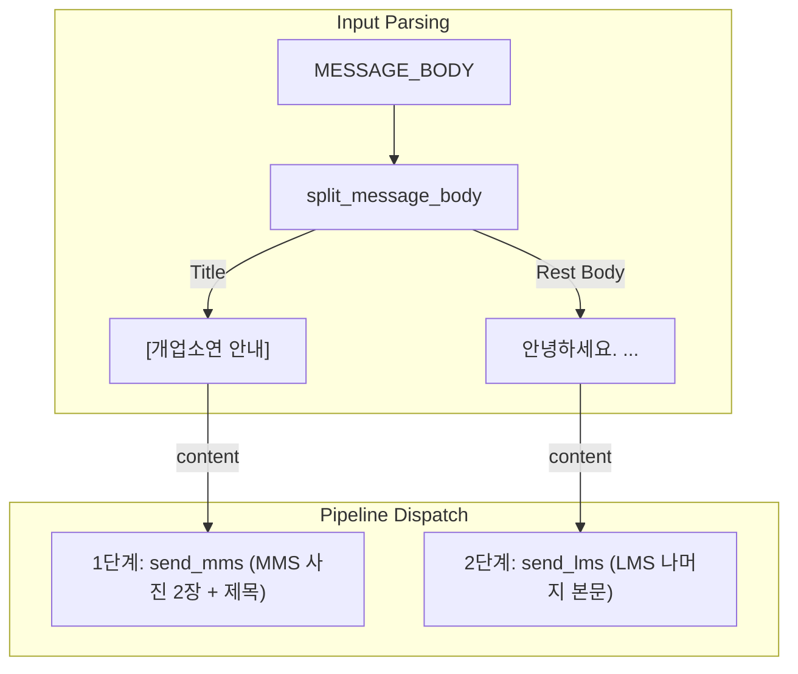

# MMS 1단계 제목 분리 발송 Implementation Plan

> **For agentic workers:** REQUIRED SUB-SKILL: Use superpowers:subagent-driven-development to implement this plan task-by-task. Steps use checkbox (`- [ ]`) syntax for tracking.

**Goal:** MMS 2단계 분리 발송 중 1단계 MMS 발송 시 통신사의 `3009` (메시지 형식 오류)를 방지하기 위해, 본문의 첫 줄 제목(`[개업소연 안내]`)을 1단계 MMS의 content로 사용하고, 2단계 LMS 발송 시에는 해당 제목을 제외한 나머지 본문 내용만 전송하도록 수정합니다.

**Architecture:**
1. `sens_mms/inputs.py`에 `split_message_body(body)` 헬퍼 함수를 추가하여 본문을 첫 줄 대괄호 제목(`title`)과 나머지 내용(`rest`)으로 분리하는 기능을 개발합니다.
2. `sens_mms/api.py`의 `send_mms`와 `send_lms`가 `content` 매개변수를 인자로 받아 요청 페이로드로 전송할 수 있도록 시그니처를 수정합니다.
3. `sens_mms/pipeline.py`의 `RecipientPipeline`에서 분리된 제목을 MMS 단계 content로, 나머지 본문을 LMS 단계 content로 적용하여 발송하도록 연동합니다.
4. `AGENTS.md` 규약 문서를 최신 명세 및 동작 방식과 일치하도록 업데이트합니다.

**Architecture Diagram:**



**Tech Stack:** Python 3.14, pytest

## Global Constraints
- `results/result.csv` 스키마 및 상태 모델(`SENT`, `FAILED`, `PENDING_CONFIRMATION`)은 그대로 보존되어야 함.
- 어떠한 개인정보(마스킹되지 않은 수신번호, 비밀 인증키, 서명 등)도 로그나 화면에 노출되지 않아야 함.
- `MESSAGE_BODY` 원본 자체는 `sens_mms/inputs.py`에 원본 그대로 보존되어야 하며, 동등성 테스트를 유지함.

---

## Proposed Changes

### Task 1: `AGENTS.md` 규약 수정 및 `sens_mms/inputs.py` 구현

**Files:**
- Modify: [AGENTS.md](file:///C:/workflows/sens-mms/AGENTS.md)
- Modify: [inputs.py](file:///C:/workflows/sens-mms/sens_mms/inputs.py)
- Test: [test_inputs.py](file:///C:/workflows/sens-mms/tests/test_inputs.py)

**Interfaces:**
- Produces: `split_message_body(body: str) -> tuple[str, str]`

- [ ] **Step 1: Write the failing test for inputs.py**

```python
def test_split_message_body_with_title():
    from sens_mms.inputs import split_message_body
    body = "[Test Title]\n\nHello World\nLine 2\n"
    title, rest = split_message_body(body)
    assert title == "[Test Title]"
    assert rest == "Hello World\nLine 2\n"

def test_split_message_body_without_title():
    from sens_mms.inputs import split_message_body
    body = "Hello World\nLine 2\n"
    title, rest = split_message_body(body)
    assert title == " "
    assert rest == "Hello World\nLine 2\n"
```

- [ ] **Step 2: Run test to verify it fails**

Run: `uv run pytest tests/test_inputs.py -v`

- [ ] **Step 3: Implement `split_message_body` in inputs.py and update AGENTS.md**

`sens_mms/inputs.py` 구현 예시:
```python
def split_message_body(body: str) -> tuple[str, str]:
    lines = body.splitlines()
    if lines and lines[0].startswith("[") and lines[0].endswith("]"):
        title = lines[0]
        idx = 1
        while idx < len(lines) and not lines[idx].strip():
            idx += 1
        rest = "\n".join(lines[idx:])
        if body.endswith("\n") and rest and not rest.endswith("\n"):
            rest += "\n"
        return title, rest
    return " ", body
```

`AGENTS.md` 수정:
MMS 요청 파트 및 본문 규칙 파트의 공백(`" "`) 하드코딩 설명 부분을 제목(`[개업소연 안내]`) 분리 전송 규칙으로 업데이트합니다.

- [ ] **Step 4: Run test to verify it passes**

Run: `uv run pytest tests/test_inputs.py -v`

- [ ] **Step 5: Commit**

```bash
git add AGENTS.md sens_mms/inputs.py tests/test_inputs.py
git commit -m "feat: implement split_message_body and update AGENTS.md rules"
```

---

### Task 2: `sens_mms/api.py` 및 `tests/test_api.py` 수정

**Files:**
- Modify: [api.py](file:///C:/workflows/sens-mms/sens_mms/api.py:318-357)
- Modify: [test_api.py](file:///C:/workflows/sens-mms/tests/test_api.py:749-794)

**Interfaces:**
- Consumes: `split_message_body`
- Produces: `send_mms(..., content: str)` 및 `send_lms(..., content: str)`

- [ ] **Step 1: Write/Modify tests in `test_api.py` to expect custom content payloads**

```diff
-    def test_send_mms_builds_payload_with_files_and_space_content(self):
+    def test_send_mms_builds_payload_with_files_and_custom_content(self):
         transport = RecordingTransport([response(202, {
             "requestId": "request-1",
             "requestTime": "2026-08-13T10:00:00.000",
             "statusCode": "202",
             "statusName": "success",
         })])
-        actual = client(transport).send_mms("01012345678", ("file-1", "file-2"), content_type="COMM")
+        actual = client(transport).send_mms("01012345678", ("file-1", "file-2"), content_type="COMM", content="[개업소연 안내]")
         self.assertEqual(actual.request_id, "request-1")
         method, url, headers, body, _ = transport.calls[0]
         payload = json.loads(body)
         self.assertEqual(payload["type"], "MMS")
-        self.assertEqual(payload["content"], " ")
+        self.assertEqual(payload["content"], "[개업소연 안내]")
```

- [ ] **Step 2: Run tests to verify they fail**

Run: `uv run pytest tests/test_api.py -v`

- [ ] **Step 3: Update `send_mms` and `send_lms` signatures and implementation in `api.py`**

```python
    def send_mms(
        self,
        to: str,
        file_ids: Sequence[str],
        *,
        content_type: str,
        content: str = " ",
    ) -> SendResponse:
        ...
        return self._send_message(
            {
                "type": "MMS",
                "contentType": content_type,
                "countryCode": "82",
                "from": self._from_number,
                "content": content,
                "messages": [{"to": to}],
                "files": [{"fileId": file_id} for file_id in file_ids],
            }
        )
```

- [ ] **Step 4: Run tests to verify they pass**

Run: `uv run pytest tests/test_api.py -v`

- [ ] **Step 5: Commit**

```bash
git add sens_mms/api.py tests/test_api.py
git commit -m "feat: support custom content in send_mms and send_lms client APIs"
```

---

### Task 3: `sens_mms/pipeline.py` 및 `tests/test_pipeline.py` 수정

**Files:**
- Modify: [pipeline.py](file:///C:/workflows/sens-mms/sens_mms/pipeline.py)
- Modify: [test_pipeline.py](file:///C:/workflows/sens-mms/tests/test_pipeline.py)

**Interfaces:**
- Consumes: `split_message_body`, `send_mms(..., content)`, `send_lms(..., content)`

- [ ] **Step 1: Modify tests in `test_pipeline.py` to assert custom content is passed to SENS API**

`tests/test_pipeline.py` 내의 `RecordingTransport` 또는 Mocking이 전송받는 `content` 파라미터가 1단계에서는 `[개업소연 안내]`가 되고 2단계에서는 그 외의 본문이 됨을 검증하도록 Mock 또는 API 스파이를 보완합니다.

- [ ] **Step 2: Run tests to verify they fail**

Run: `uv run pytest tests/test_pipeline.py -v`

- [ ] **Step 3: Modify `_execute_stage` and split orchestration in `pipeline.py`**

`pipeline.py`에서 `_execute_stage`를 호출할 때 `content` 값을 인자로 전달하도록 구조를 매핑합니다:
```python
        title, lms_body = split_message_body(MESSAGE_BODY)
        if stage == "MMS":
            mms_result = self._execute_stage(
                "MMS",
                row,
                work,
                tuple(file_ids),
                content=title,
                ...
            )
        else:
            return self._execute_stage(
                "LMS",
                row,
                work,
                file_ids=(),
                content=lms_body,
                ...
            )
```
그리고 `_execute_stage` 함수 내에서 `api.send_mms` / `api.send_lms`를 전송할 때 `content` 인자를 넘기도록 수정합니다.

- [ ] **Step 4: Run all tests to verify everything passes**

Run: `uv run pytest`

- [ ] **Step 5: Commit**

```bash
git add sens_mms/pipeline.py tests/test_pipeline.py
git commit -m "feat: connect split body logic to pipeline stages and verify all tests"
```

---

## Verification Plan

### Automated Tests
- `uv run pytest`로 전체 300개 이상의 단위 테스트 및 워크플로우 통합 테스트가 통과하는지 확인합니다.
- `tests/test_inputs.py`에 추가된 본문 분리 로직 동등성 테스트를 통과하는지 검증합니다.

### Manual Verification
- 드라이런 또는 테스트용 모의 발송 명령을 이용해 발송되는 페이로드가 정확히 나뉘는지 터미널의 진행 로그를 확인합니다.
